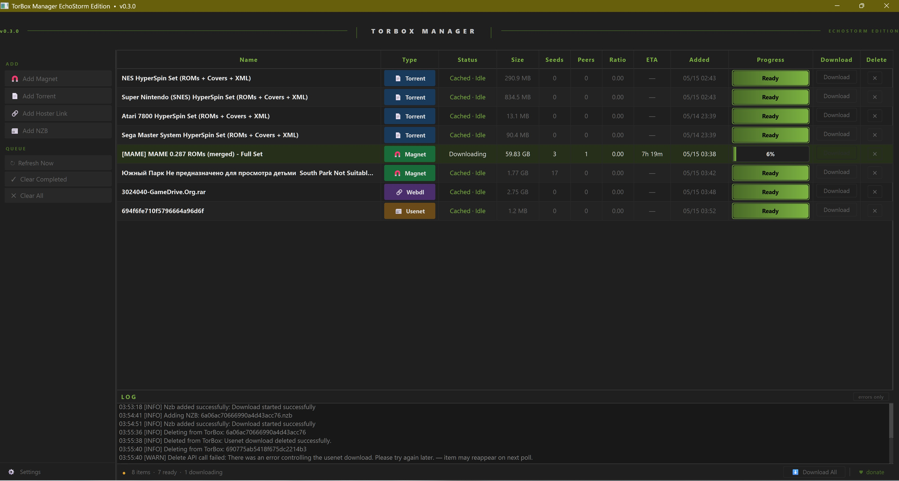

# TorBox Manager — EchoStorm Edition

A desktop queue manager for [TorBox](https://torbox.app) debrid. Add torrents, magnets, hoster links, and NZBs — watch them process on TorBox's servers — download finished files straight to your machine. No browser tab required.

Built for people coming from Real-Debrid who want that same familiar desktop workflow on TorBox.

---

## What it looks like

The screenshot above is a real session from v0.3. Eight items in the queue — torrents, a magnet, a hoster link, and an NZB — all managed from one window. The MAME set is actively downloading at 6%. Everything else is cached and ready to grab.

---

## What you need

- **Windows 10 or 11**
- **A TorBox account** and your API key — find it at torbox.app → Account → API

That's it. No Python, no installs, no admin rights needed.

---

## How to install

1. Download **`TorBox_Manager.exe`** from the [Releases](../../releases) page
2. Drop it anywhere you want (Desktop, `C:\Tools`, wherever)
3. Double-click it

No setup wizard. No installer. Just the one file.

---

## First launch

When the app opens it'll ask for your **API key** and a **download folder**. Fill those in, hit Save, and you're done.

`config.json` and `TorBox_Manager_Log.txt` are created next to the exe on first run.

---

## What it does

- **Add anything** — magnet links, .torrent files, hoster URLs (1Fichier, Mega, Pixeldrain etc.), and .nzb files
- **Unified queue** — everything in one table regardless of type, with status, size, seeds, peers, progress
- **Multi-file torrents** — picks which files you want before downloading, so you're not stuck grabbing the whole set
- **Downloads to your folder** — streams directly to wherever you set, with a live progress bar per file
- **Controlled downloads** — concurrency limit keeps your connection usable; Download All queues everything and feeds the next item as each slot frees up
- **Right-click rows** — Copy Name, Copy Download Link, Open in Browser (hoster links) — right on the row
- **Stays out of your way** — minimizes to the system tray, slows its polling to 5-minute intervals when idle so it's not hammering the API all night
- **Tray notifications** — optional popup when a download finishes (off by default, toggle in Settings)
- **Remembers where you left it** — window position and size restored on every launch

---

## Settings

Open via the gear icon bottom-left.

| Setting | What it does | Default |
|---|---|---|
| API Key | Your TorBox bearer token | required |
| Download Directory | Where files land | prompted on first download |
| Concurrent Downloads | Max simultaneous local downloads | 3 |
| Poll Interval | How often to check TorBox | 30 seconds |
| Minimize to Tray | Hide to tray on close instead of quitting | on |
| Tray Notifications | Popup when a download finishes | off |

Config saves to `config.json` next to the exe. Nothing goes to the registry or AppData.

---

## Frequently asked things

**Windows Defender flagged the exe or it was slow to open the first time**
That's normal for freshly built executables — Defender scans them on first launch. If it hard-blocks it: right-click the exe → Properties → Unblock. This is a false positive; the exe bundles Python and PyQt6 and nothing else.

**My item shows a hash instead of a name (like `694f6fe710f5...`)**
That's a TorBox thing on some usenet items — it returns the internal hash before it resolves the real name. The app now renders those in italic/dimmed text so you know it's a pending resolution, not a bug. The download still works fine, and the name updates on the next poll once TorBox sorts it out.

**Where's the log file?**
`TorBox_Manager_Log.txt` next to the exe. It gets overwritten each launch so it only has the current session.

**I want to run from source instead**
Clone the repo, install Python 3.10+, and run `launch.bat`. See the `tbm/` folder for source and requirements.

---

## Version history

**v0.5.0** — Concurrency limit, right-click row menu, Retry button, polling pause when idle, window geometry persistence, usenet hash dimming, log auto-trim, 7 bug fixes

**v0.4.0** — Standalone exe build, multi-file torrent picker, tray notifications, referral link in About, User-Agent header, various fixes

**v0.3.0** — Clipboard paste buttons, threaded add/delete, log filter, status bar breakdown, layout polish

**v0.2.0** — Optional columns (Seeds, Peers, Ratio, ETA, Added), auto-retry on download errors, minimize-to-tray toggle

**v0.1.0** — Initial release

---

## Support

If this is useful, a Ko-fi helps a lot: [ko-fi.com/xechostormx](https://ko-fi.com/xechostormx) ♥

Not on TorBox yet? [referral link](https://torbox.app/subscription?referral=bd158452-a00c-4bce-be2a-593351ccaec7)

---

## License

MIT — see LICENSE
