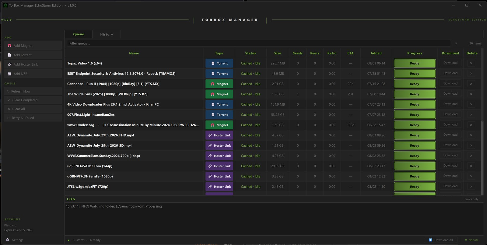

# TorBox Manager — EchoStorm Edition

A desktop queue manager for [TorBox](https://torbox.app) debrid. Add torrents, magnets, hoster links, and NZBs — watch them process on TorBox's servers — download finished files straight to your machine. No browser tab required.

Built for people coming from Real-Debrid who want that same familiar desktop workflow on TorBox.

---

## What it looks like

The screenshot above shows the queue in action — torrents, a magnet, a hoster link, and an NZB all managed from one window. The MAME set is actively downloading. Everything else is cached and ready to grab. (Screenshot is from an earlier build; the UI has grown since then.)

---

## What you need

- **Windows 10 or 11**
- **A TorBox account** and your API key — find it at torbox.app → Account → API

That's it. No Python, no installs, no admin rights needed.

---

## How to install

1. Download **`TorBox_Manager.exe`** from the [Releases](../../releases) page
2. Drop it anywhere you want (Desktop, `C:\Tools`, wherever)
3. Double-click it

No setup wizard. No installer. Just the one file.

---

## First launch

When the app opens it'll ask for your **API key** and a **download folder**. Fill those in, hit Save, and you're done.

`config.json` and `TorBox_Manager_Log.txt` are created next to the exe on first run.

---

## What it does

- **Add anything** — magnet links, .torrent files, hoster URLs (1Fichier, Mega, Pixeldrain etc.), and .nzb files
- **Unified queue** — everything in one table regardless of type, with live status, size, seeds, peers, ETA, and progress bars
- **Sortable, filterable, multi-select** — click any column header to sort; search bar filters rows by name in real time; Ctrl/Shift-click rows for bulk Download or Delete from the right-click menu
- **Multi-file torrents** — pick exactly which files you want before downloading; one worker per file, all in parallel
- **Downloads to your folder** — streams directly to disk with a live progress bar; each item gets its own named subfolder automatically; cancel an in-progress download anytime from the right-click menu
- **Auto-extract** — archives (.zip, .rar, .7z, .tar.*) are extracted on a background thread immediately after download, with path-traversal protection against malicious archives; optionally deletes the archive after extraction
- **Watch folder** — drop .torrent or .nzb files into a folder and they get submitted to TorBox automatically, with a delete-after-submit option
- **Download history** — every completed download is logged; the History tab shows them all newest-first with double-click to open in Explorer and right-click to copy the path
- **Controlled downloads** — concurrency limit (default 3) keeps your connection usable; Download All (and bulk-selected downloads) warn first if there isn't enough free disk space, then queue the rest and drain as slots free up
- **Right-click rows** — Copy Name, Copy Download Link, Open in Browser (hoster links), Cancel Download — right on the row
- **Multi-link hoster input** — paste a batch of hoster URLs at once, one per line
- **Duplicate warning** — adding a magnet already in your queue asks first instead of silently double-submitting
- **Update notifications** — checks GitHub Releases silently on startup; a button appears in the status bar if a newer version is out
- **Stays out of your way** — minimizes to the system tray, slows polling to 5-minute intervals when idle
- **Tray notifications** — optional popup when a download finishes (off by default)
- **Remembers where you left it** — window position and size restored on every launch

---

## Settings

Open via the gear icon bottom-left.

| Setting | What it does | Default |
|---|---|---|
| API Key | Your TorBox bearer token | required |
| Download Directory | Where files land | prompted on first download |
| Concurrent Downloads | Max simultaneous local downloads | 3 |
| Poll Interval | How often to check TorBox | 30 seconds |
| Minimize to Tray | Hide to tray on close instead of quitting | on |
| Tray Notifications | Popup when a download finishes | off |
| Create subfolder per download | Each item gets its own named subfolder | on |
| Auto-extract archives | Extract .zip/.rar/.7z/.tar.* after download | on |
| Delete archive after extraction | Remove archive once extracted | off |
| Remove from TorBox after download | Delete remote queue entry when local download completes | off |
| Watch folder | Auto-submit .torrent/.nzb files dropped into a folder | off |
| Delete from watch folder after submit | Remove the file from the watch folder on success | on |

Config saves to `config.json` next to the exe. Nothing goes to the registry or AppData.

---

## Frequently asked things

**Windows Defender flagged the exe or it was slow to open the first time**
That's normal for freshly built executables — Defender scans them on first launch. If it hard-blocks it: right-click the exe → Properties → Unblock. This is a false positive; the exe bundles Python and PyQt6 and nothing else.

**My item shows a hash instead of a name (like `694f6fe710f5...`)**
That's a TorBox thing on some usenet items — it returns the internal hash before it resolves the real name. The app renders those in italic/dimmed text so you know it's a pending resolution, not a bug. The download still works fine, and the name updates on the next poll once TorBox sorts it out.

**Where's the log file?**
`TorBox_Manager_Log.txt` next to the exe. It gets overwritten each launch so it only covers the current session. There's also an in-app log strip at the bottom of the window with an "errors only" filter.

**Where's the download history stored?**
`download_history.json` next to the exe, same folder as `config.json`. It keeps the last 500 completed downloads. You can also view and clear it from the History tab in the app.

**I want to run from source instead**
Clone the repo, install Python 3.10+, and run `launch.bat`. It creates a venv, installs dependencies, and launches the app. Optional dependencies (py7zr, rarfile) are installed automatically if missing. See `tbm/` for source and `requirements.txt` for the full list.

**Auto-extract isn't working for .rar or .7z**
These need optional packages — `rarfile` (+ unrar.exe or WinRAR in PATH for .rar) and `py7zr` (for .7z). `launch.bat` installs them automatically. If you're running from source manually, run `pip install py7zr rarfile` in your venv. .zip and .tar.* always work with no extras.

---

## Version history

**v0.7.5** — Security fix (archive path-traversal/"Zip Slip" protection in auto-extract) and a
bugfix + feature sweep: Clear All no longer corrupts history for in-flight downloads, poll
responses can no longer race each other, items removed elsewhere on TorBox are now cleaned up
automatically, filenames are hardened against Windows reserved names and path-length limits.
New: multi-select with bulk Download/Delete, sortable columns, cancel an in-progress download,
duplicate-magnet warning, low-disk-space warning before batch downloads. Faster polling
(concurrent endpoint fetches) and less table churn on large queues.

**v0.7.4** — Sharp taskbar icon (multi-size ICO bundled and used for window icon)

**v0.7.3** — Console window eliminated (launch.bat, Explorer open, unrar.exe all suppressed)

**v0.7.2** — Settings dialog scrollable (Save always visible), .7z/.rar support in distributed exe

**v0.7.1** — Download history tab, 4 bug fixes (history table alignment, Settings delete-after toggle dependency, clear history error handling, docstring)

**v0.7.0** — Per-item subfolders, auto-extract archives, watch folder, delete from TorBox after download, queue filter bar, 4 bug fixes (startup crash from missing QLineEdit import, stale version number, tarfile deprecation warning, Explorer path quoting)

**v0.6.0** — Multi-link hoster input, update notifications, 5 bug fixes (right-click link always failed, multi-file torrent button stuck as Open, Retry wired to wrong handler, frozen Restart crash, config upgrade dropped column keys)

**v0.5.0** — Concurrency limit, right-click row menu, Retry button, polling pause when idle, window geometry persistence, usenet hash dimming, log auto-trim, 7 bug fixes

**v0.4.0** — Standalone exe build, multi-file torrent picker, tray notifications, referral link in About, User-Agent header, various fixes

**v0.3.0** — Clipboard paste buttons, threaded add/delete, log filter, status bar breakdown, layout polish

**v0.2.0** — Optional columns (Seeds, Peers, Ratio, ETA, Added), auto-retry on download errors, minimize-to-tray toggle

**v0.1.0** — Initial release

---

## Support

If this is useful, a Ko-fi helps a lot: [ko-fi.com/xechostormx](https://ko-fi.com/xechostormx) ♥

Not on TorBox yet? [referral link](https://torbox.app/subscription?referral=bd158452-a00c-4bce-be2a-593351ccaec7)

---

## License

MIT — see LICENSE
